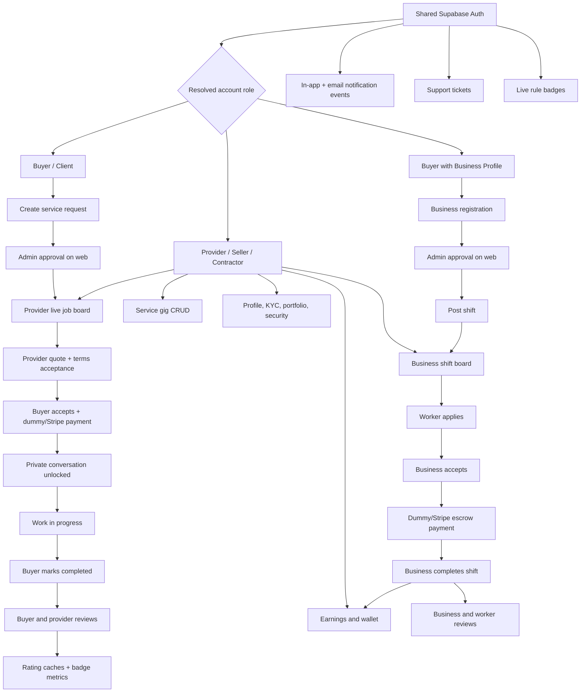
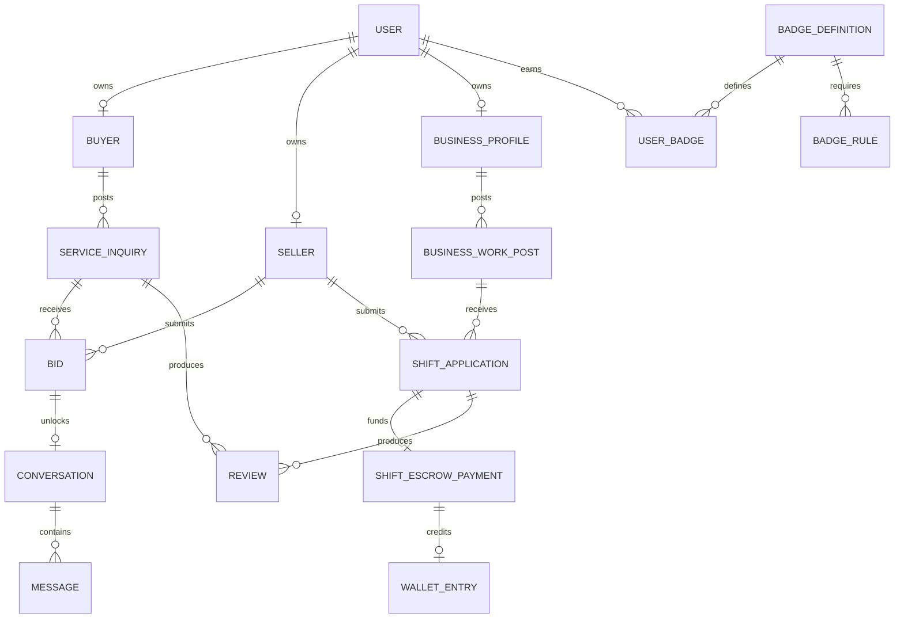

# AnyJob Mobile

AnyJob Mobile is the Expo/React Native client for the existing AnyJob marketplace. It uses the same Supabase project, identities, records, role approvals, reviews, badges, jobs, shifts, conversations, and server-side business rules as the Next.js web application.

Admin tooling remains web-only by design. Every customer-facing role is supported:

- Buyers and clients
- Providers and sellers
- Independent contractors and provider businesses
- Approved business accounts and their shift workers

The project targets Expo SDK 57, React Native 0.86, React 19.2, and Expo Router 57. It runs on iOS, Android, and React Native Web.

## Product Graph



## Architecture

```text
anyjob-mobile/
├── assets/                       Expo icons and launch assets
├── src/
│   ├── app/                      Expo Router routes
│   │   ├── (auth)/               Welcome, login, registration, recovery
│   │   ├── (app)/                Authenticated five-tab shell
│   │   ├── business/             Registration, shifts, applications
│   │   ├── conversation/         Realtime-style polling chat
│   │   ├── jobs/                 Provider marketplace and quote detail
│   │   ├── provider/             Profile, KYC, work history, analytics
│   │   ├── request/              New buyer request
│   │   ├── requests/             Buyer request lifecycle and quotes
│   │   └── review/               Two-way review submission
│   ├── components/               Shared UI and domain screens
│   ├── lib/
│   │   ├── api.ts                Bearer-authenticated Next.js API client
│   │   ├── storage.ts            SecureStore native / AsyncStorage web
│   │   └── supabase.ts           Shared Supabase auth client
│   ├── providers/                Auth and TanStack Query providers
│   ├── theme/                    AnyJob design tokens
│   └── types/                    Shared mobile domain types
├── .env.example                  Public client configuration template
├── app.json                      Expo, native IDs, plugins, web output
└── package.json                  SDK-compatible dependencies and scripts
```

The mobile app deliberately has two backend paths:

1. Supabase Auth is called directly from the device. Sessions persist in encrypted SecureStore on iOS/Android and AsyncStorage on web.
2. Marketplace mutations and protected aggregates call the existing Next.js API with `Authorization: Bearer <access-token>`. This preserves server-side validation, service-role joins, KYC checks, plan limits, notification events, payment state transitions, and review authorization.

The shared web server client accepts both its existing secure cookies and mobile bearer tokens. Web behavior remains unchanged.

## Feature Coverage

### Shared account and auth

- Email/password sign-in against the existing Supabase tenant
- Buyer and provider registration using existing validated registration APIs
- Persistent sessions and automatic token refresh
- Password recovery and authenticated password change
- Role resolution from `eloo_profiles`, `sellers`, and auth metadata
- Buyer, provider, contractor, and business-aware navigation
- Personal profile editing
- Provider public profile editing
- Native profile-photo and four-image portfolio uploads
- Verification status where admin approval is authoritative KYC completion
- Identity document, selfie video, provider insurance, and business registration uploads
- Notifications and unread state
- Full received/given reviews page
- Live badge milestones and exact done/pending rule metrics
- Support ticket creation, history, and customer replies
- Buyer and provider plan catalog with hosted subscription checkout
- Optional device biometric lock preference

### Buyer/client

- Provider marketplace search
- Public provider profiles, services, genuine ratings, and verification state
- Device-saved provider shortlist
- Service request creation with job, location, schedule, scope, and budget
- Request moderation status
- Request list and detail timeline
- Quote comparison with provider statistics
- Quote acceptance through dummy payment by default; Stripe can be enabled later
- Chat unlock after accepted and paid quote
- Start and completion state controls
- Buyer-to-provider review after completion
- Provider-to-buyer reviews shown on the buyer account
- Business registration entry from the same buyer identity

### Provider/seller/contractor

- Approved live jobs and AnyJob Select jobs
- Coarse pre-acceptance location privacy
- Buyer trust state and ratings only when real ratings exist
- Quote submission with amount, availability, duration, message, and current terms acceptance
- Pending and accepted offer history
- Paid booking conversations
- Service gig create, edit, publish, and delete
- Shift board filtered by enabled worker niches
- Shift applications and current application/payment state
- Completed service and shift history on one page
- Earnings wallet with pending, available, and paid-out totals
- Provider-to-buyer and worker-to-business reviews
- Public profile, service category, availability, rates, and location
- Provider verification status
- Completion, earnings, review, and badge analytics

### Business

- Business registration under an existing buyer identity
- Admin approval state
- Shift/job posting for approved businesses
- Role, niche, schedule, location, headcount, rates, and requirements
- Application list enriched with provider identity
- Accept/reject worker application
- Dummy escrow funding by default
- Shift completion and wallet release
- Business-to-worker and worker-to-business reviews
- Business work post history
- Approved shift-worker discovery by niche

### Communication and trust

- Conversation list with unread counts
- Chronological messages
- Automatic scroll to the newest message on load and send
- Five-second foreground refresh for cross-device messages
- Job/payment/review/account notifications
- Review summaries only when ratings exist
- Full review history separated from compact account summaries
- Badge milestone metric evaluation from live database rules
- Admin-controlled moderation remains on the web admin dashboard

## Data Model

The app reads or mutates these existing Supabase tables through authenticated APIs:

| Domain           | Tables                                                                                                     |
| ---------------- | ---------------------------------------------------------------------------------------------------------- |
| Identity         | `auth.users`, `eloo_profiles`, `user_profiles`, `buyers`, `sellers`                                        |
| Buyer work       | `service_inquiries`, `bids`, `eloo_bookings`, `user_images`                                                |
| Provider catalog | `eloo_provider_services`, `provider_plan_subscriptions`, `provider_terms_acceptances`                      |
| Business work    | `business_profiles`, `business_work_posts`, `shift_worker_profiles`, `shift_applications`                  |
| Payments         | `shift_escrow_payments`, `provider_wallet_entries`, `buyer_plan_subscriptions`                             |
| Messaging        | `eloo_conversations`, `eloo_messages`, `eloo_notifications`                                                |
| Trust            | `eloo_reviews`, `badge_definitions`, `badge_rules`, `user_badges`, `provider_badges`, `badge_award_events` |
| Support          | `support_tickets`, `support_ticket_messages`                                                               |
| AnyJob Select    | `service_inquiries`, `admin_select_quote_acceptances`                                                      |



## Navigation Map

The authenticated tab shell is immediate and remains mounted while content queries load:

- Home: role-aware dashboard and quick actions
- Explore: providers for buyers, approved jobs for providers
- Work: complete role-specific workflow index
- Inbox: conversations and notification entry
- Account: identity, reviews, KYC, milestones, business, security, and support

Detailed routes:

| Route                    | Purpose                                        |
| ------------------------ | ---------------------------------------------- |
| `/requests`              | Buyer request history                          |
| `/requests/[id]`         | Quotes, payment, progress, completion          |
| `/request/new`           | New service request                            |
| `/jobs/[id]`             | Provider job detail and quote submission       |
| `/conversation/[id]`     | Paid-booking messaging                         |
| `/services`              | Provider service gig CRUD                      |
| `/shifts`                | Provider business-shift board                  |
| `/earnings`              | Provider wallet                                |
| `/provider/pending`      | Provider active offers                         |
| `/provider/completed`    | Completed services and shifts                  |
| `/provider/analytics`    | Provider performance                           |
| `/business`              | Registration and business work posts           |
| `/business/shift/new`    | New business shift                             |
| `/business/applications` | Worker selection, pay, complete, review        |
| `/business/workers`      | Approved worker discovery by niche             |
| `/plans`                 | Buyer, provider, or business plan catalog      |
| `/reviews`               | Full received/given reviews                    |
| `/review/new`            | Authorized two-way review form                 |
| `/milestones`            | Live badge rule progress                       |
| `/notifications`         | Notification history and read state            |
| `/support`               | Support ticket center                          |
| `/profile`               | Buyer profile                                  |
| `/provider/profile`      | Provider profile                               |
| `/verification`          | Buyer KYC status                               |
| `/provider/verification` | Provider KYC status                            |
| `/security`              | Password and local app security                |
| `/reset-password`        | Recovery-link validation and new password form |

## Setup

Requirements:

- Node.js 22 or newer
- npm
- Expo Go compatible with SDK 57, or an iOS/Android development build
- Public Supabase URL and anon key for the same project as the web app

```bash
cd anyjob-mobile
cp .env.example .env.local
npm install
npm start
```

Set these values in `.env.local`:

```dotenv
EXPO_PUBLIC_SUPABASE_URL=https://your-project.supabase.co
EXPO_PUBLIC_SUPABASE_ANON_KEY=your-public-anon-key
EXPO_PUBLIC_WEB_API_URL=https://anyjob-mu.vercel.app
```

For a deployed Expo web client on a different origin, add its exact origin to the API deployment's comma-separated `MOBILE_APP_ORIGINS` value. Local Expo origins on `localhost` and `127.0.0.1` are allowed automatically.

The Supabase anon key is intentionally public and protected by RLS and server validation. Never place the service-role key, Stripe secret, email provider secret, or any other private credential in an `EXPO_PUBLIC_` variable.

## Run and Test

```bash
npm run typecheck
npm run lint
npm run build:web
npm run web
npm run ios
npm run android
```

`npm run build:web` exports a production React Native Web bundle to `dist/`. For local browser testing, run `npm run web` and open the URL printed by Expo. The completed QA record is in [`QA.md`](./QA.md).

Recommended workflow test accounts should cover:

1. Approved buyer posts a service request.
2. Admin approves it on the web admin dashboard.
3. Approved provider submits a quote in mobile.
4. Buyer accepts and completes dummy payment.
5. Both users confirm messaging works.
6. Buyer starts and completes the request.
7. Buyer and provider submit reviews.
8. Approved business posts a shift.
9. Shift-enabled provider applies.
10. Business accepts, pays dummy escrow, and completes.
11. Business and worker submit reviews.
12. Provider confirms released shift payment in Earnings and completed shift in Completed.

## Payment Mode

The app currently follows the requested test-app behavior: quote acceptance and shift escrow use fake loading and immediately complete a dummy payment when `STRIPE_ENABLED` is not exactly `true`. Provider and buyer subscriptions also activate a 30-day dummy plan when no Stripe secret exists. No card is required in local/test mode.

When Stripe is ready:

1. Configure the existing server-side Stripe secret.
2. Set `STRIPE_ENABLED=true` on the web/API deployment.
3. Keep all Stripe operations server-side.
4. The mobile client will open the returned hosted checkout URL without shipping secret keys in the app. Subscription endpoints automatically use hosted checkout when a valid Stripe secret is present.

## Approximate Location

- Location is requested only after a buyer taps **Use current area** while posting a task.
- Android requests coarse location and explicitly blocks fine-location permission.
- Coordinates are rounded to two decimal places on the device before submission, approximately kilometre-level precision.
- The mobile flow stores only `coarse_latitude`, `coarse_longitude`, an approximate area label, and a minimum 1 km accuracy value.
- Providers see the city/postal-prefix area and optional approximate distance while quoting. The exact address remains behind acceptance and payment.
- Buyers can decline location access and enter a city or postal area manually.

## Appearance

- Buyer and provider tab surfaces support System, Light, and Dark themes.
- The preference is persisted locally and can be changed from **Profile > Appearance**.

## Security Boundaries

- Admin routes and service-role credentials never ship in the mobile bundle.
- Mobile auth tokens are sent only to the configured AnyJob API origin.
- SecureStore is used for native session persistence.
- Exact buyer addresses remain hidden from providers before paid acceptance.
- Quote, review, job status, business approval, and payment transitions are validated server-side.
- Review submission validates the completed job/shift and the relationship between reviewer and reviewee.
- Admin review deletion and moderation remain web-only.
- `EXPO_PUBLIC_` values are treated as public build-time configuration.

## Deployment

For EAS, create project environments containing the three public variables above, then configure bundle identifiers and signing through EAS. The Android package is `ie.anyjob.mobile`; choose the final iOS bundle identifier before App Store submission.

Before production release, complete device QA on current iOS and Android versions, verify universal/app links for password reset and payment return URLs, add store privacy disclosures, configure push credentials, and replace test assets with final AnyJob icons and splash artwork.
